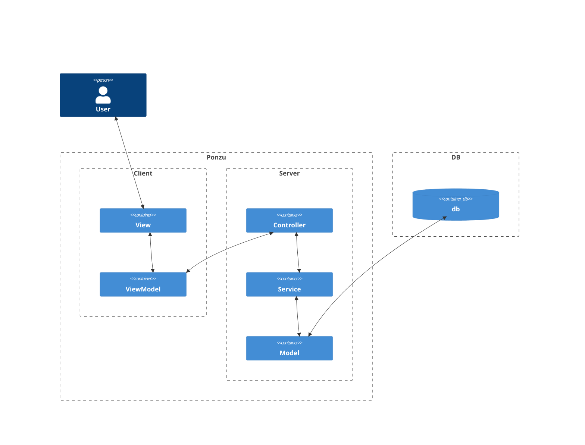
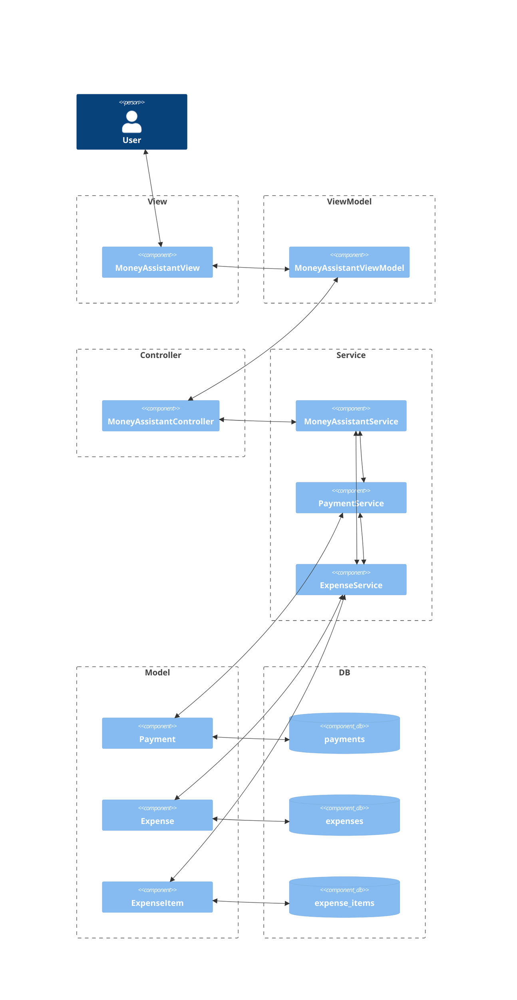
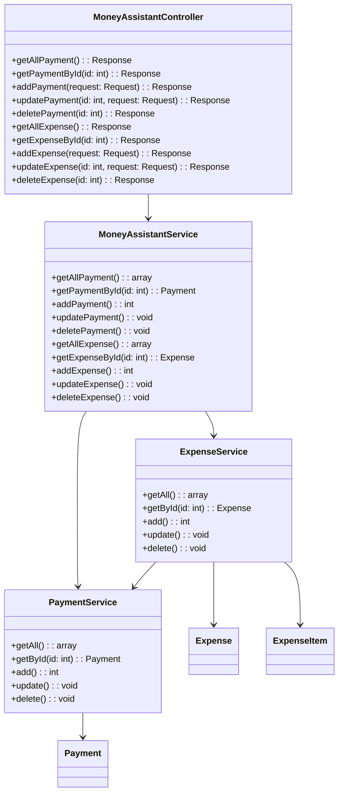
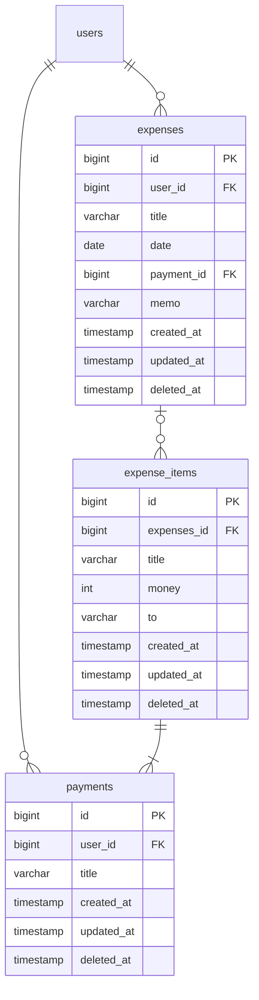

# MoneyAssistant

## About

- Manage money inflow and outflow.

## Container

```mermaid
C4Context
  Person(user, "User", "")

  Boundary(ponzu, "Ponzu", "") {
    Boundary(client, "Client", "") {
      Container(view, "View", "", "")

      Container(view_model, "ViewModel", "", "")
    }

    Boundary(server, "Server", "") {
      Container(controller, "Controller", "", "")

      Container(service, "Service", "", "")

      Container(model, "Model", "", "")
    }
  }

  Boundary(db, "DB", "") {
    ContainerDb(db, "db", "", "")
  }

  BiRel(user, view, "", "")
  BiRel(view, view_model, "", "")
  BiRel(view_model, controller, "", "")
  BiRel(controller, service, "", "")
  BiRel(service, model, "", "")
  BiRel(model, db, "", "")
```

## Component

```mermaid
C4Context
  Person(user, "User", "")

  Boundary(view, "View", "") {
    Component(money_assistant_view, "MoneyAssistantView", "", "")
  }

  Boundary(view_model, "ViewModel", "") {
    Component(money_assistant_view_model, "MoneyAssistantViewModel", "", "")
  }

  Boundary(controller, "Controller", "") {
    Component(money_assistant_controller, "MoneyAssistantController", "", "")
  }

  Boundary(service, "Service", "") {
    Component(money_assistant_service, "MoneyAssistantService", "", "")

    Component(payment_service, "PaymentService", "", "")

    Component(expense_service, "ExpenseService", "", "")
  }

  Boundary(model, "Model", "") {
    Component(model-payment, "Payment", "", "")

    Component(model-expense, "Expense", "", "")

    Component(model-expense_item, "ExpenseItem", "", "")
  }

  Boundary(db, "DB", "") {
    ComponentDb(db-payments, "payments", "", "")

    ComponentDb(db-expenses, "expenses", "", "")

    ComponentDb(db-expense_items, "expense_items", "", "")
  }

  BiRel(user, money_assistant_view, "", "")

  BiRel(money_assistant_view, money_assistant_view_model, "", "")

  BiRel(money_assistant_view_model, money_assistant_controller, "", "")

  BiRel(money_assistant_controller, money_assistant_service, "", "")

  BiRel(money_assistant_service, expense_service, "", "")
  BiRel(money_assistant_service, payment_service, "", "")
  BiRel(expense_service, payment_service, "", "")

  BiRel(payment_service, model-payment, "", "")
  BiRel(expense_service, model-expense, "", "")
  BiRel(expense_service, model-expense_item, "", "")

  BiRel(model-payment, db-payments, "", "")
  BiRel(model-expense, db-expenses, "", "")
  BiRel(model-expense_item, db-expense_items, "", "")
```

## Class

```mermaid
classDiagram
  class MoneyAssistantController {
    +getAllPayment(): Response
    +getPaymentById(id: int): Response
    +addPayment(request: Request): Response
    +updatePayment(id: int, request: Request): Response
    +deletePayment(id: int): Response

    +getAllExpense(): Response
    +getExpenseById(id: int): Response
    +addExpense(request: Request): Response
    +updateExpense(id: int, request: Request): Response
    +deleteExpense(id: int): Response
  }

  class MoneyAssistantService {
    +getAllPayment(): array
    +getPaymentById(id: int): Payment
    +addPayment(): int
    +updatePayment(): void
    +deletePayment(): void

    +getAllExpense(): array
    +getExpenseById(id: int): Expense
    +addExpense(): int
    +updateExpense(): void
    +deleteExpense(): void
  }

  class PaymentService {
    +getAll(): array
    +getById(id: int): Payment
    +add(): int
    +update(): void
    +delete(): void
  }

  class ExpenseService {
    +getAll(): array
    +getById(id: int): Expense
    +add(): int
    +update(): void
    +delete(): void
  }

  class Payment

  class Expense

  class ExpenseItem

  MoneyAssistantController --> MoneyAssistantService

  MoneyAssistantService --> PaymentService
  MoneyAssistantService --> ExpenseService
  ExpenseService --> PaymentService

  PaymentService --> Payment
  ExpenseService --> Expense
  ExpenseService --> ExpenseItem
```

## ER Diagram

```mermaid
erDiagram
  users

  payments {
    bigint id PK
    bigint user_id FK
    varchar title
    timestamp created_at
    timestamp updated_at
    timestamp deleted_at
  }

  expenses {
    bigint id PK
    bigint user_id FK
    varchar title
    date date
    bigint payment_id FK
    varchar memo
    timestamp created_at
    timestamp updated_at
    timestamp deleted_at
  }

  expense_items {
    bigint id PK
    bigint expenses_id FK
    varchar title
    int money
    varchar to
    timestamp created_at
    timestamp updated_at
    timestamp deleted_at
  }

  users ||--o{ payments : ""
  users ||--o{ expenses : ""
  expense_items ||--|{ payments : ""
  expenses |o--o{ expense_items : ""
```
