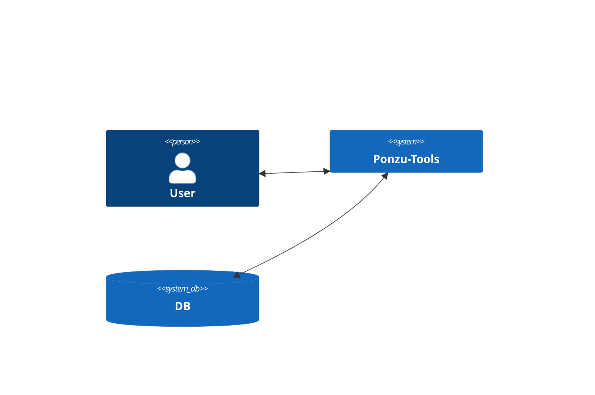
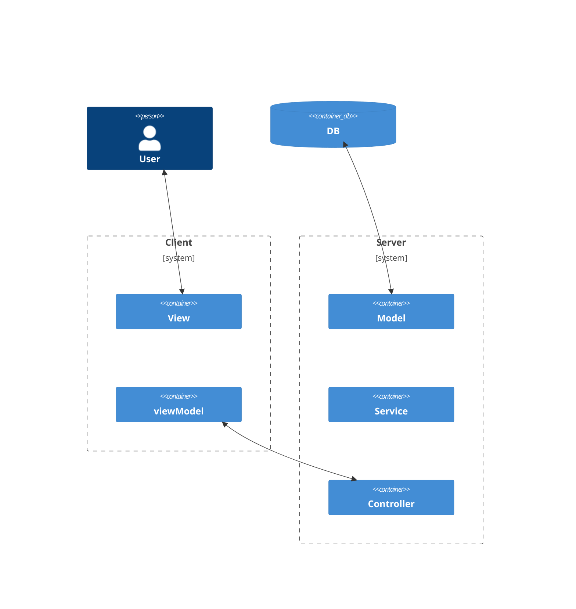
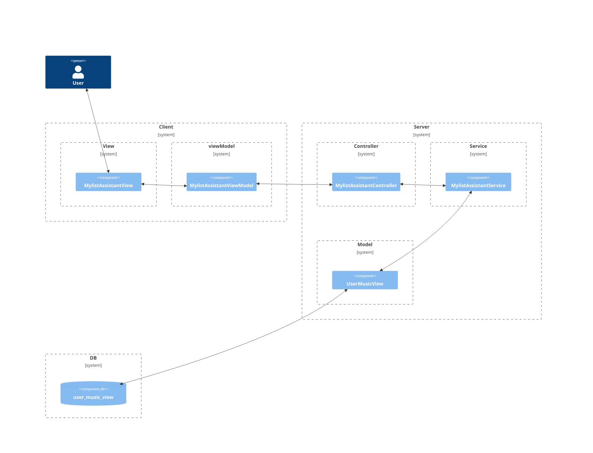
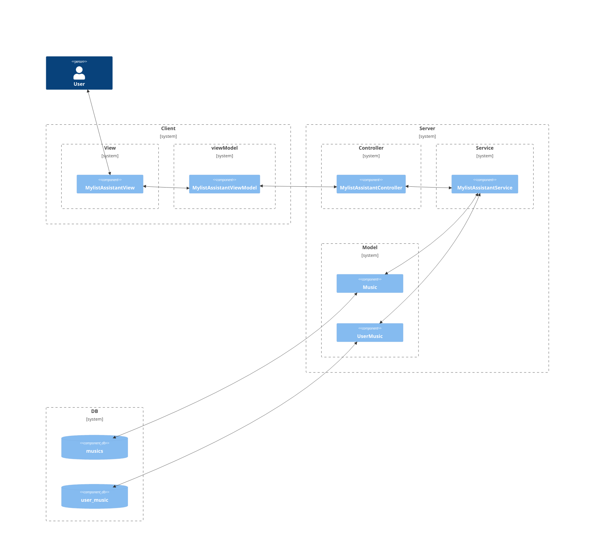
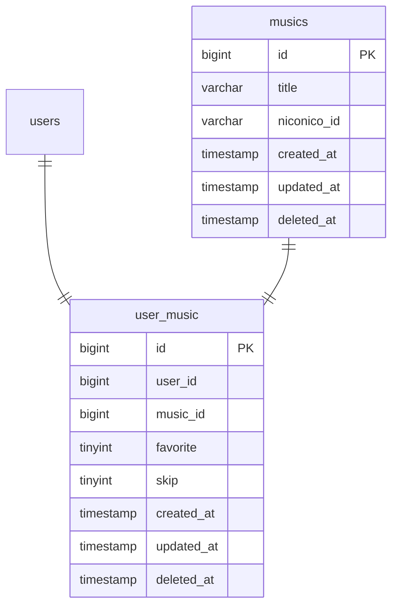

# MylistAssistant

## Context

```mermaid
C4Context
    Person(user, "User")

    System(ponzu-tools, "Ponzu-Tools")

    SystemDb(db, "DB")

    BiRel(user, ponzu-tools, "")
    BiRel(ponzu-tools, db, "")
```

## Container

```mermaid
C4Context
    Person(user, "User")

    Boundary(client, "Client") {
        Container(view, "View")
        Container(viewModel, "viewModel")
    }

    Boundary(service, "Server") {
        Container(model, "Model")
        Container(service, "Service")
        Container(controller, "Controller")
    }

    ContainerDb(db, "DB")

    BiRel(user, view, "")
    BiRel(viewModel, controller, "")
    BiRel(model, db, "")
```

## Component

### Get All, Get By Id

```mermaid
C4Context
    Person(user, "User")

    Boundary(client, "Client") {
        Boundary(view, "View") {
            Component(mylist-assistant, "MylistAssistantView")
        }
        Boundary(viewModel, "viewModel") {
            Component(mylist-assistant-view-model, "MylistAssistantViewModel")
        }
    }

    Boundary(server, "Server") {
        Boundary(controller, "Controller") {
            Component(mylist-assistant-controller, "MylistAssistantController")
        }
        Boundary(service, "Service") {
            Component(mylist-assistant-service, "MylistAssistantService")
        }
        Boundary(model, "Model") {
            Component(user-music-view, "UserMusicView")
        }
    }

    Boundary(db, "DB") {
        ComponentDb(user_music_view, "user_music_view")
    }

    BiRel(user, mylist-assistant, "")
    BiRel(mylist-assistant, mylist-assistant-view-model, "")
    BiRel(mylist-assistant-view-model, mylist-assistant-controller, "")
    BiRel(mylist-assistant-controller, mylist-assistant-service, "")
    BiRel(mylist-assistant-service, user-music-view, "")
    BiRel(user-music-view, user_music_view, "")
```

### Add, Update, Delete

```mermaid
C4Context
    Person(user, "User")

    Boundary(client, "Client") {
        Boundary(view, "View") {
            Component(mylist-assistant, "MylistAssistantView")
        }
        Boundary(viewModel, "viewModel") {
            Component(mylist-assistant-view-model, "MylistAssistantViewModel")
        }
    }

    Boundary(server, "Server") {
        Boundary(controller, "Controller") {
            Component(mylist-assistant-controller, "MylistAssistantController")
        }
        Boundary(service, "Service") {
            Component(mylist-assistant-service, "MylistAssistantService")
        }
        Boundary(model, "Model") {
            Component(music, "Music")
            Component(user-music, "UserMusic")
        }
    }

    Boundary(db, "DB") {
        ComponentDb(musics, "musics")
        ComponentDb(user_music, "user_music")
    }

    BiRel(user, mylist-assistant, "")
    BiRel(mylist-assistant, mylist-assistant-view-model, "")
    BiRel(mylist-assistant-view-model, mylist-assistant-controller, "")
    BiRel(mylist-assistant-controller, mylist-assistant-service, "")
    BiRel(mylist-assistant-service, music, "")
    BiRel(mylist-assistant-service, user-music, "")
    BiRel(music, musics, "")
    BiRel(user-music, user_music, "")
```

## ER Diagram

```mermaid
erDiagram
    users

    musics {
        bigint id PK
        varchar title
        varchar niconico_id
        timestamp created_at
        timestamp updated_at
        timestamp deleted_at
    }

    user_music {
        bigint id PK
        bigint user_id
        bigint music_id
        tinyint favorite
        tinyint skip
        timestamp created_at
        timestamp updated_at
        timestamp deleted_at
    }

    users ||--|| user_music : ""
    musics ||--|| user_music : ""
```

## Class Diagram
